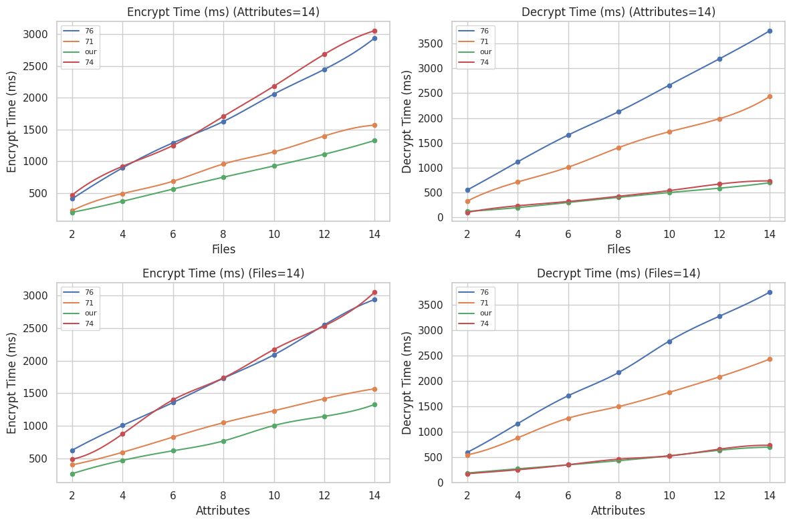
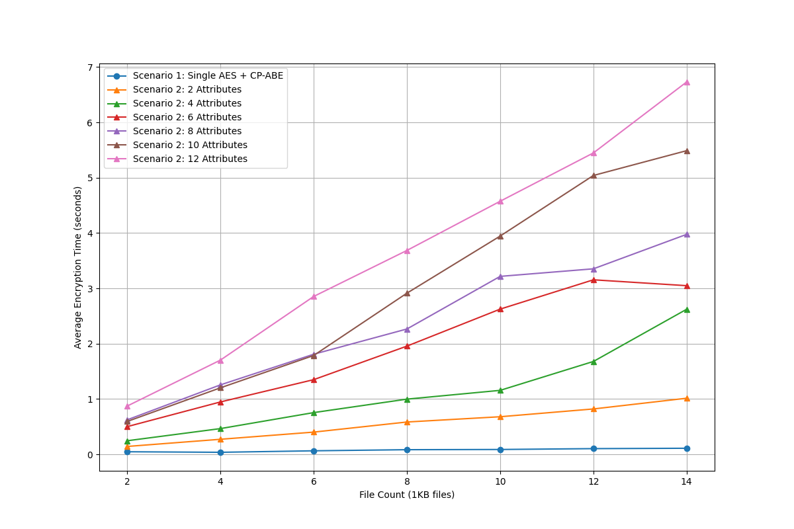
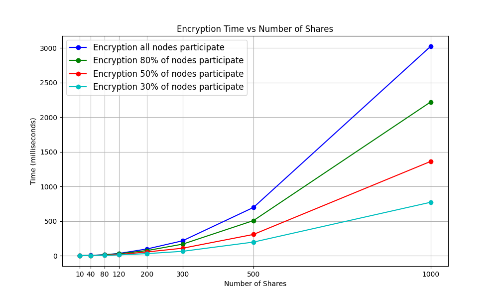
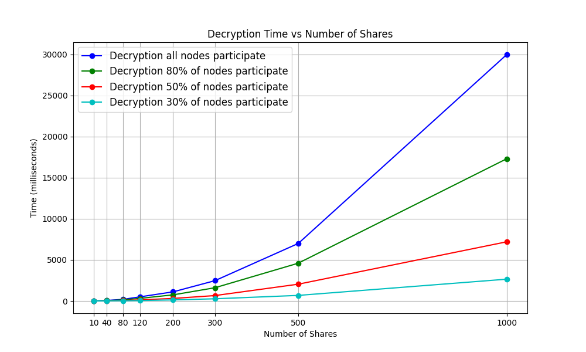

## ☑️ Some Decentralized Access Control Implementations for IPFS

---

## 🚀 Papers

- **2-Q1-2025-3-Data_Sharing_in_the_Metaverse_With_Key_Abuse_Resistance_Based_on**
- **7-Q1-2024-5-CR_FH_CPABE_Secure_File_Hierarchy_Attribute_Based_Encryption_Scheme**
- **8-Q1-2025-0-Multi_Authority_CP_ABE_Scheme_With_Cryptographic_Reverse_Firewalls**

---

## 📸 Screenshots

  <h4>🏠 Project Images</h4>

  <table>
    <tr>
        <td></td>
        <td></td>
    </tr>
    <tr>
        <td></td>
        <td></td>
    </tr>
  </table>

